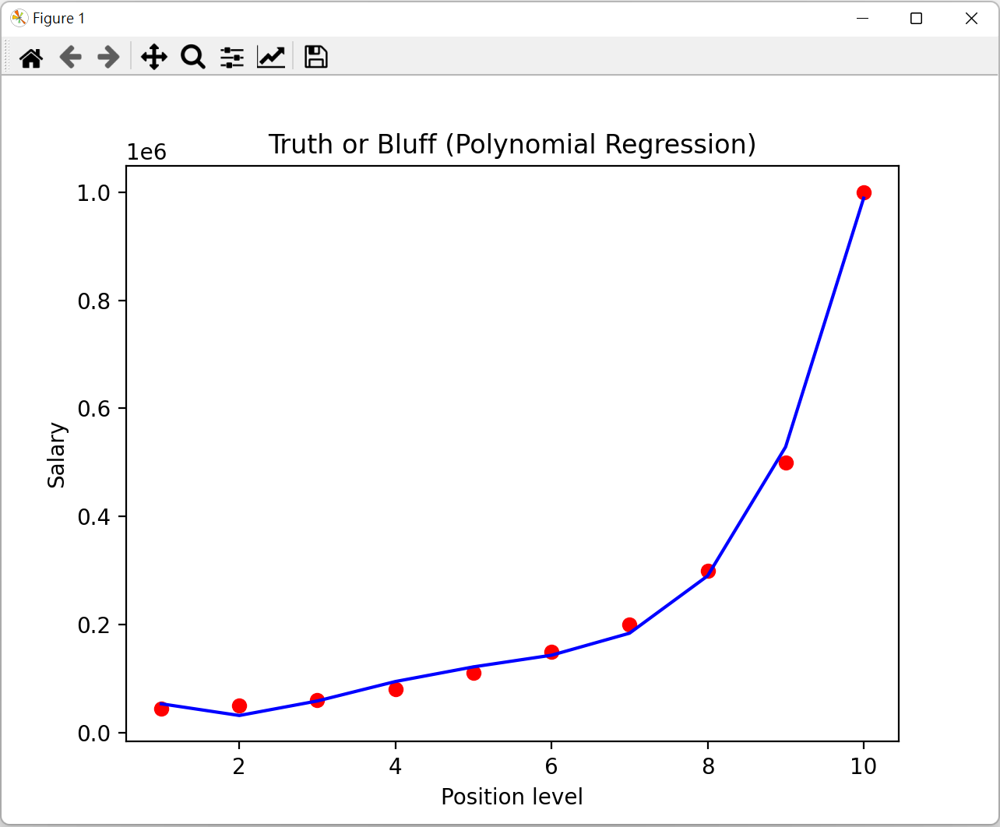

# <Strong>_Description_</Strong>

Practice machine learning by using numpy and sklearn.

 

# <Strong>_Tools & Git page_</Strong>

 
 
<strong>Git page: **https://github.com/LeonTsai2021 **</strong> 
 

 

# <Strong>_Features_</Strong>

## <Strong>_Linear_</Strong>

## <Strong>_Polynomial_</Strong>

 
